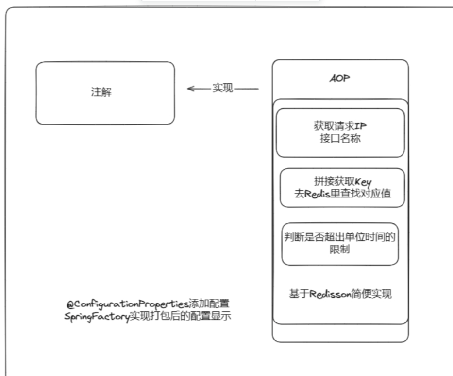

# 限流SDK

基于Redisson和SpringAop开发的自定义限流注解，通过maven安装到本地环境供项目使用


## **所用技术栈**

- Redisson限流
- SpringAop


## 项目架构




```c++
 ├─src
 │  ├─main
 │  │  ├─java
 │  │  │  └─com
 │  │  │      └─shaoxia
 │  │  │          └─ratelimit
 │  │  │              ├─annotation
 │  │  │              ├─aop
 │  │  │              └─exception
 │  │  └─resources
 │  │      └─META-INF
```